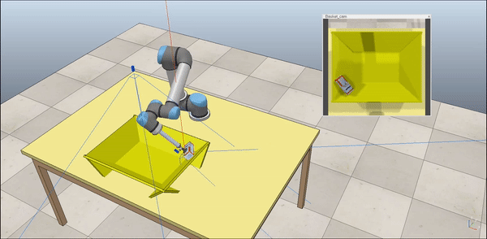

## Reinforcement Learning for Picking Cluttered General Objects with Dense Object Descriptors

  |   | 
:----------------------:|:----------------------:|:----------------------:

## Tutorial
- [](./doc/tutorial.md)

## Supplementary videos
* We also uploaded some demonstration videos of picking, grasping, and finding matching points:
https://drive.google.com/file/d/1p1dxUSUGxx9E0rwDH7hEwIDaAH60_lya/view?usp=sharing
* NeurIPS presentation videos:
https://drive.google.com/file/d/1XJdk2ARhOOriptnwe73lJxnCEmdP8LO8/view?usp=sharing


#### Citing

If this work is useful for your reserach, please consider to cite:

```
@article{giangcao2022cods,
  title={Reinforcement Learning for Picking Cluttered General Objects with Dense Object Descriptors},
  author={Hoang-Giang Cao, Weihao Zeng, I-Chen Wu},
  journal={IEEE International Conference on Robotics and Automation},
  year={2022}
}
```
