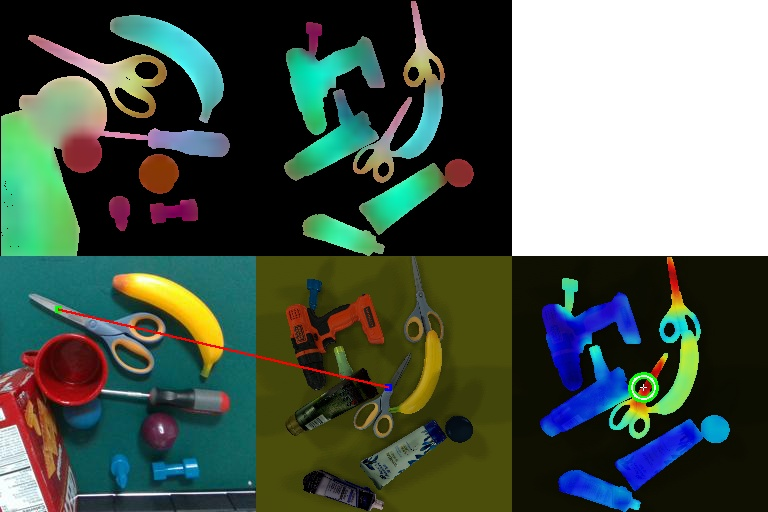

# Reinforcement Learning for Picking Cluttered General Objects with Dense Object Descriptors
## Codes
The project is uploaded here: https://github.com/hgiangcao/CODs


Note that the data is for demonstrate purpose only. You might want to download full data for training CODs at: https://drive.google.com/file/d/1kazXNIBVy-ziNpd8-mt7g7-Mtyb8VYhY/view?usp=sharing

The full assets files are uploaded at: https://drive.google.com/file/d/1AA-ItHr4mHeTF-vfOy_nL9JfBGPStE6v/view?usp=sharing
You shoulld copy and replace all files in assets folder.

## Requirements
Make sure that your enviroment have all required packages:
```
pip install -r requirements.txt
```

We use Ubuntu 20.04 with python 3.7 to implement the project.
Pytorch`==`1.5 with cuda10.1, and torchvision`==`0.6.
```
pip install torch==1.5.1+cu101 torchvision==0.6.1+cu101 -f https://download.pytorch.org/whl/torch_stable.html
```
## Jupyter-notebook files
We created notebook files for the tutorial:
* checkData.ipynb: verifying data.
* checkDataGenerator: verifying data generator for match and non-match points.
* DON_training_tutorial: tutorial for training CODs.
* DON_Picking_Real_tutorial: tutorial for test picking cluttered objects.

## DON Data
The data for training CODs is organized as follow:
```
|-- DON_data
    |-- GraspNet_models (all in one 87 GraspNet 3D vertex models and vertex color)
    |   |-- allModels.pkl
    |   |-- allModelsCollor.pkl
    |-- GraspNet_train_O2O_sm_lg_orig 
    |   |-- Object99/
    |   |   |-- 000/
    |   |   |-- 000/
    |   |   |-- ... ...
    |   |   |-- 029/
    |   |-- intrinsic.txt
    |-- GraspNet_train_O2O_sm_lg_rd 
    |   |-- Object99/
    |   |   |-- 000/
    |   |   |-- 000/
    |   |   |-- ... ...
    |   |   |-- 029/
    |   |-- intrinsic.txt
```
To verify that we have all data for runing the project properly, please run `checkData.ipynb` and make sure that all return are **OK** without any problem.
## DON Training


For training CODs, please refer to `notebooks/DON_Training_tutorial.ipynb`.
Edit `ITRIP/config.yml` for changing the training parameters. 
To change the path to save the model (and also the tensorboard), change the `setting` parameter in `ITRIP/config.yml`.

Please check the path to save the model and the tensorboard carefully.

After finish the training, there is a small test to verify that we succesfully trained the DON. The program will load a pre-trained model and evaluate 1000 matching-point pairs from a random pair of images.
The result should look similar as below:
```
DONE training CODs
Error Distance: 0.0449
Accuracy: 0.922
```

## CODs Evaluation
To evaluate CODs result in detail, run `DON_Training/testCorrespondace_O2O.py` to visualize the finding matching point between 2 seleted pair of images. These two images should both contain some same objects (at least one).
The result should look similar as below:




## Picking Training
The program is design with Client-Server.
The client run multiple envinroments, while server side inference, sample data and train the model.
**Client side:**
* Run multiple environments.
* For each run:
  * Capture the RGB-D image, send the image to the Server.
  * Get actions responed from the Server.
  * Apply the actions to the correspondence   environment to get the next state.
  * Capture the RGB-D, calculte the reward and send to Server.

**Server side:**
* Training the model with PPO
* For each run:
    * Get the RGB-Ds from the servers.
    * Inference through the network, sample the actions to return to the Client.
    * Save data for training: tuple (s,a,r,s',t).
    * After collect enough `opt.local_steps`:
        * Train the models based on Actor-Critic with PPO.

To run the training:
**Client side**
run : `python clientPicking.py --num_envs=2 --host="localhost" --port =123 --nObject=5 --setting="client_demo_picking"`
**Server side**
run : `python serverPicking.py --port =123 ----setting="server_demo_picking"`
Check the parameters `opt` in each file to configure the training in detail.

## Picking Sim Evaluation
To run the evaluation:
**Client side**
run : `python clientPicking.py --num_envs=2 --host="localhost" --port =123 --nObject=5"`
**Server side**
run: `python serverPickingRUNetEval.py --port =123 --pretrained="path_to_file"
`
Check the parameters `opt` in each file to configure the training in detail.

## Supplementary videos
* We also uploaded some demonstration videos of picking, grasping, and finding matching points:
https://drive.google.com/file/d/1p1dxUSUGxx9E0rwDH7hEwIDaAH60_lya/view?usp=sharing
* NeurIPS presentation videos:
https://drive.google.com/file/d/1XJdk2ARhOOriptnwe73lJxnCEmdP8LO8/view?usp=sharing

## 


#### Citing

If this work is useful for your reserach, please consider to cite:

```
@article{giangcao2022cods,
  title={Reinforcement Learning for Picking Cluttered General Objects with Dense Object Descriptors},
  author={Hoang-Giang Cao, Weihao Zeng, I-Chen Wu},
  journal={IEEE International Conference on Robotics and Automation},
  year={2022}
}
```
